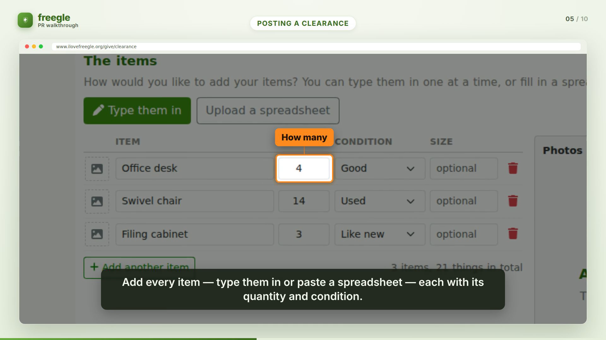

# PR Walkthrough Video Generator

Turn a GitHub PR into a calm, **annotated walkthrough video at human viewing speed** — the
opposite of a Playwright recording that whizzes through the UI to satisfy an assertion. The
video points at the changed screens, captions what is happening, and tells the story of the
feature so a reviewer can *see* what changed without reading the diff.

Built with [Remotion](https://remotion.dev) (React → video). The example is
[Freegle/Iznik #618](https://github.com/Freegle/Iznik/pull/618) — bulk-offer "clearance"
listings.

> **Scope rule:** a walkthrough shows **externally-visible function only** — what a person
> using the product sees and does. No code, data models, APIs, migrations or diff stats.



## How it works

```
gh PR ──▶ fetch ──▶ capture (live worktree) ──▶ analyze ──▶ mask PII ──▶ render ──▶ walkthrough.mp4
```

Decoupled stages around a single, validated **storyboard** (the "script"):

| stage | file | does |
|---|---|---|
| **fetch** | `src/fetch.mjs` | PR metadata + diff + test files (`gh`); downloads any screenshots from the PR body as a fallback. |
| **capture** | `src/capture.mjs` | Drives a **preexisting running worktree** of the PR to each screen in `capture-plan.json` and saves **fresh** screenshots. Read-only (never submits). |
| **analyze** | `src/analyze.mjs` | Validates `storyboard.json` and reports the **function coverage signal mined from the PR's tests**. |
| **render** | `src/render.mjs` | Bakes PII masks, stages the masked assets, and renders the MP4 with Remotion. |

> **The tool never builds the target PR.** It films against live code by pointing a browser
> at a worktree someone else already has running (`--base-url`). It does not check out,
> build, or edit that worktree — and capture is non-mutating, so it never writes to its DB.

### One command (live)

```bash
# point --base-url at a RUNNING worktree for the PR (get the URL from `./freegle status`)
node pr-walkthrough.mjs 618 --repo Freegle/Iznik \
     --base-url http://freegle-dev-live.localhost:12023
# → prs/pr-618/out/pr-618-walkthrough.mp4
```

Without `--base-url`, capture is skipped and whatever screenshots are already in
`prs/pr-618/assets/` are used (handy for iterating on the storyboard offline).

### Or stage by stage

```bash
node src/fetch.mjs   618 --repo Freegle/Iznik
node src/capture.mjs --pr-dir prs/pr-618 --base-url <running worktree URL>
node src/analyze.mjs --pr-dir prs/pr-618           # validates storyboard + test coverage
node src/render.mjs  --pr-dir prs/pr-618           # masks + renders
npm run studio                                      # live-preview/edit in Remotion Studio
```

## The storyboard (the script you can review against the PR)

`prs/pr-618/storyboard.json` is plain JSON, validated by `src/storyboard-schema.mjs`.
Coordinates (`focus`, callout `box`, `pan`) are **fractions (0..1) of the screenshot's
natural size**, so they are resolution-independent and authorable by eye. Scene types:

- `title` / `outro` — branded cards.
- `narration` — a heading + bullets + caption (framing / "why"; text only).
- `screenshot` — the substance: a screenshot with a `focus` zoom (or `pan:"down"` scroll),
  a lower-third `caption`, and `callouts` that reveal **sequentially**, each pointing at a
  control with a short label.

> **Tall pages crop.** A scene with a `focus` fits that band to the viewport **width** and lets
> the height overflow — so on a page taller than 16:9 the bottom is cut off (e.g. a long form's
> footer never shows). To show a tall page in full: omit `focus` (the renderer *contains* the
> whole image), use `pan:"down"` to glide top→bottom, or capture the part that matters as its own
> `clip: "<selector>"` shot so it fills the frame.

Because the storyboard is just data, you can read it against the PR and judge whether it does
the brief *before* spending a render — and tweak a caption or a callout and re-render in one
command.

### Who writes the storyboard

- **`--analyzer manual`** (default) uses the committed `storyboard.json`. The 618 example was
  authored by reading the diff + screenshots directly — the analysis the brief asks for — and
  is kept as the golden reference.
- **`--analyzer claude`** builds the prompt in `prompts/analyze.md` from the PR material and
  asks the `claude` CLI to write the storyboard. It is **opt-in** (it spends tokens) and never
  runs unless you ask for it.

## Capturing from live code

`prs/pr-<n>/capture-plan.json` says how to drive the **running** app to each screen worth
filming. Selectors prefer the PR's own `data-testid` hooks; seeded ids / credentials come
from the environment (`${BULK_MSG_ID}`, etc.), so nothing is hardcoded. A shot:

```jsonc
{ "name": "clearance-composer.png", "route": "/give/clearance", "fullPage": true,
  "steps": [ { "fill": "testid=clearance-title", "value": "Office Clearance" },
             { "click": "testid=mode-manual" },
             { "fill": "testid=item-name-0", "value": "Office desk" } ] }
```

Run it against a worktree someone already has up:

```bash
node src/capture.mjs --pr-dir prs/pr-618 --base-url http://freegle-dev-live.localhost:12023
BULK_MSG_ID=1234 node src/capture.mjs --pr-dir prs/pr-618 --base-url <url>   # seeded shots
```

**Read-only by design.** A plan may fill fields and toggle controls to reach a state, but
clicks on submit/save controls (`Post these items`, `Register interest`, `clearance-submit`,
…) are **refused** — so capturing never writes to the target's database or files.

**Auto-measured callout coordinates.** A shot can list `annotate: [{ selector, label, arrow }]`.
After reaching the state, capture asks the live DOM for each element's box (document-relative)
and writes `<shot>.boxes.json` with fractional `{x,y,w,h}`. A storyboard callout then says
`{ "at", "until", "ref": "<label>" }` instead of typed coordinates, and the renderer resolves
it — and with `"focusAuto": true` it derives the scene's zoom from those boxes too. So the
*spatial* part of the script is produced by the tool, not eyeballed off a grid.

**Auth.** `src/auth.mjs --base-url <url> --email <e> --out <file>` logs in via the Freegle
login modal and saves a storageState (read-only; login doesn't mutate). Pass it to capture
with `--storage-state`, or name it per-shot as `"auth"`. Seeded users/ids/password come from
the PR's `tests/e2e/test-envs.json` + `config.js`.

The end-to-end framework (discover URL → auth → seeded env → capture → storyboard → render),
the per-PR runbook, and what's mechanical vs needs judgement, are written up in
[`plans/active/pr-walkthrough-capture-framework.md`](../plans/active/pr-walkthrough-capture-framework.md).

## Tests as the function signal

A PR's tests — **Playwright/E2E especially** — are the best signal of which functions matter.
`analyze` mines the PR's `describe/it/test` titles and prints them, starring any E2E specs, so
you can confirm the storyboard/capture-plan covers the important journeys and skips the
trivia. For 618 this is what flagged the moderator **bulk-preview** surface as worth a shot.
`prompts/analyze.md` tells the `claude` analyzer to lead with the test-covered flows.

## PII masking

Real PRs include screenshots with real people's data. `prs/pr-<n>/masks.json` lists
regions (fractions of the image) to **pixelate / blur / box**, and `src/imageutil.py`
**bakes** them into `*.masked.png` copies. The storyboard only ever references the masked
copies, and the renderer stages only those into `public/` — so the sensitive pixels never
reach the video frames (they are not merely covered with a CSS box).

To measure regions, overlay a labelled grid and read off the fractions:

```bash
python3 src/imageutil.py grid prs/pr-618/assets/recipient-interest.png /tmp/grid.png
python3 src/imageutil.py mask prs/pr-618        # bake the masked copies
```

For 618 the poster's avatar and name are pixelated; the public town/postcode-district shown
by design on Freegle is left as-is.

## Storage & embedding in the PR

These walkthroughs are mostly static screens, so H.264 compresses them to a **few MB** — not
"enormous". Rendered MP4s still don't belong in git:

- **Recommended (inline player):** drag-drop `walkthrough.mp4` into the PR description. GitHub
  hosts it on `user-attachments` and renders a `<video>` player inline. `src/publish.mjs`
  prints the exact markdown to paste.
- **Automatable:** `node src/publish.mjs --pr-dir prs/pr-618 --release <repo>` uploads the
  MP4 as a GitHub Release asset and prints a stable URL.
- **Git LFS:** `.gitattributes` routes `**/out/*.mp4` to LFS *if* a video is ever committed;
  by default `out/` is git-ignored.

## Requirements

Node 18+, `ffmpeg`, `python3` with Pillow, the `gh` CLI, and a Chrome/Chromium for Remotion
(it downloads its own headless shell on first render). No paid services.

## Files

```
pr-walkthrough.mjs          one-command pipeline (fetch → capture → analyze → render)
src/fetch.mjs               gather PR material (metadata, diff, tests, body images)
src/capture.mjs             drive a live worktree → fresh screenshots (read-only)
src/capture-plan-schema.mjs capture-plan validation
src/analyze.mjs             storyboard validation + test-coverage signal (manual | claude)
src/render.mjs              mask + validate + remotion render
src/imageutil.py            grid (measure) + mask (bake PII)
src/storyboard-schema.mjs   storyboard validation + duration math
src/index.jsx Root.jsx Walkthrough.jsx
src/scenes/*                title, narration, screenshot, code, outro
src/components/*            Brand, ProgressBar, Caption, Callout, Eyebrow
prompts/analyze.md          the analyzer prompt (external-function-only)
prs/pr-618/                 capture-plan.json, storyboard.json, masks.json, assets/, out/
```
